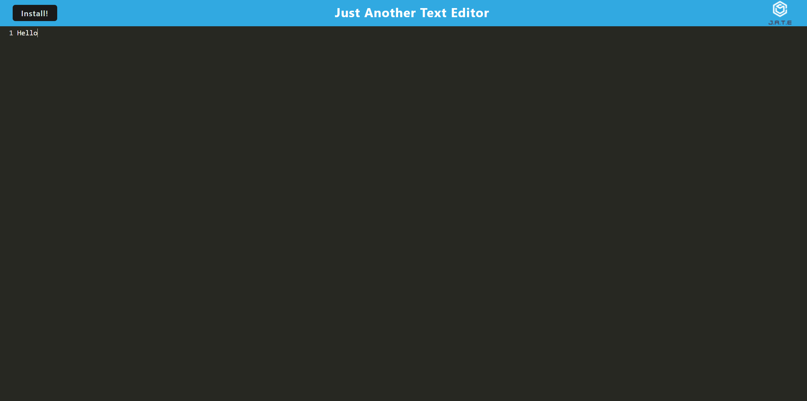

# text-editor

## Description

This application is a text editor that allows you to use it with or without internet connection. It can be downloaded as an app.

## Table of Contents

- [Installation](#installation)
- [Usage](#usage)
- [License](#license)
- [Contributions](#contributions)
- [Tests](#tests)
- [Questions](#questions)

## Installation

No installation required.

## Usage

This a just another text editor, edit the text to your hearts content.

Deployed here:
https://ch-text-editor-fda725a35477.herokuapp.com

## License

MIT

## Contributions

Cardon Hickman, U of U Fullstack Bootcamp

## Tests

Test using deployed link

## Questions

<ul>
<li> <a href = "https://github.com/C-Hickman23">GitHub Profile</a>
</li>
<li> <a href = "mailto:cardonhickman@gmail.com">Email </a> </li>
</li>
